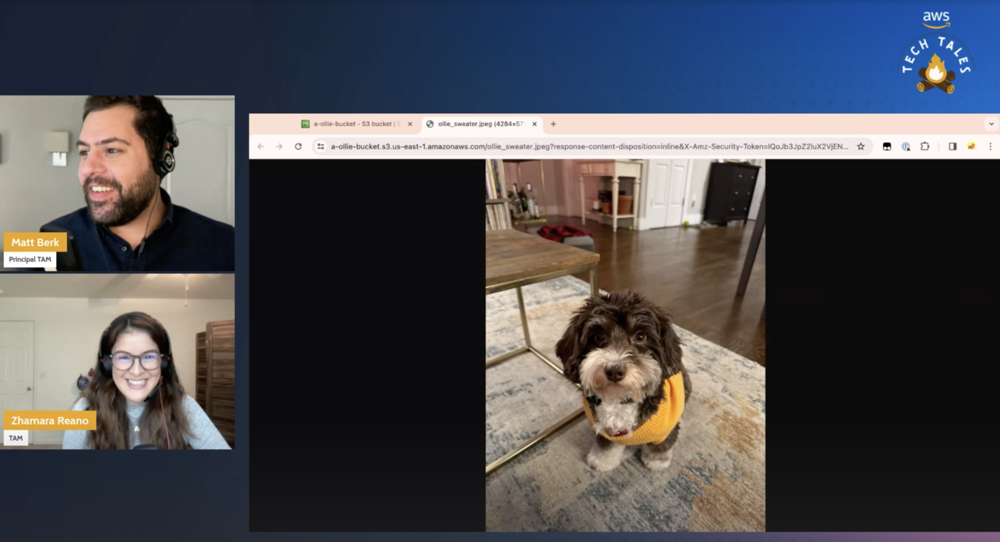

*(A Description of the episode along with any useful code snippets, images, and whatnot)*

In our Season 3 premiere, we decide to demo S3 accidental bucket deletion which is a common issue with AWS customers. Without proper protections in place, once you delete you S3 bucket it's gone forever! No support ticket or escalation can save it. So in this episode, Matt deletes his S3 bucket by mistake with photos of his dog Ollie. We explore with chat the many ways to prevent this in future including versioning, Object Lock, MFA delete, and using AWS Backup. We also talk about using S3 Storage Lens to check these settings organization-wide! 

*(the link the the TWITCH HIGHLIGHT)*
Check out the recording here:

https://www.twitch.tv/videos/2091514661

## Links from today's episode

- [Protecting Data on Amazon S3](https://aws.amazon.com/getting-started/hands-on/protect-data-on-amazon-s3/)
- [Setting up MFA Delete on S3](https://docs.aws.amazon.com/AmazonS3/latest/userguide/MultiFactorAuthenticationDelete.html)
- [AWS Backup for S3 Solution](https://repost.aws/knowledge-center/backup-s3-backups-fail-errors)

**🐦 Reach out to the hosts and guests:**

- Matt: [LinkedIn](https://www.linkedin.com/in/matthewlberk)
- Zhamara: [LinkedIn](https://www.linkedin.com/in/zhamarareano/)
