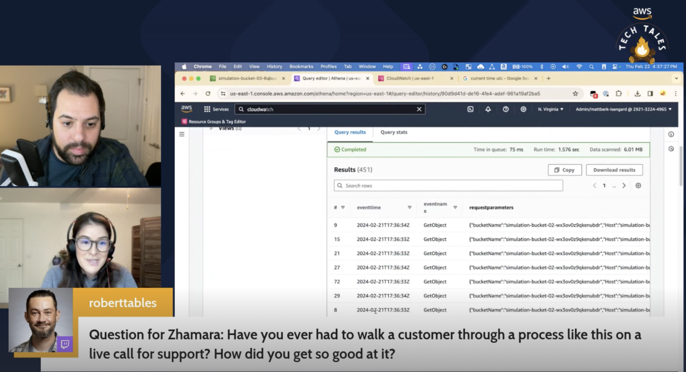

*(A Description of the episode along with any useful code snippets, images, and whatnot)*

What happens if there's an S3 security event and you're affected by a ransomware attack? How can you audit your logs to understand what happened, find the culprit, and lock your buckets down? Matt and Zhamara go through this simulation with the audience's help leveraging CloudTrail, CloudWatch, and Amazon Athena to investigate. 
 

*(the link the the TWITCH HIGHLIGHT)*
Check out the recordings here - in two parts due to a streaming hiccup:

https://www.twitch.tv/videos/2091523446
https://www.twitch.tv/videos/2091525078 

## Links from today's episode

- [Ransomware on S3 - Simulation and Detection Workshop](https://catalog.us-east-1.prod.workshops.aws/workshops/fc7b7cf3-f494-48e2-8954-258ffdd76ed6/en-US/introduction)

**🐦 Reach out to the hosts and guests:**

- Matt: [LinkedIn](https://www.linkedin.com/in/matthewlberk)
- Zhamara: [LinkedIn](https://www.linkedin.com/in/zhamarareano/)
