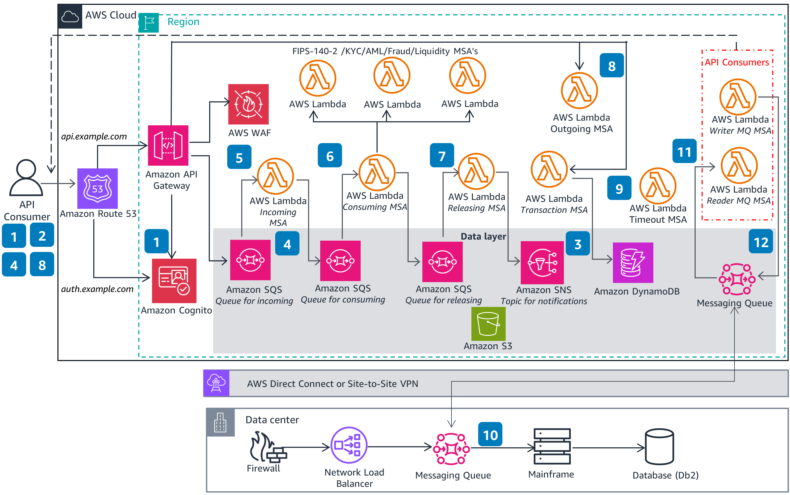

*(A Description of the episode along with any useful code snippets, images, and whatnot)*

Ever wonder how payments are processed on the backend? How do you make sure you're completely resilient but also not getting your payment sent twice? Eugene and Jack share an open source architecture for ISO2022 Messaging workflows that they developed. Now you don't have to be a big financial services company to learn from this event driven architecture! Eugene and Jack talk through the challenges of scaling up from a single region to multi-region and simluate the outages to show you how the system performs! 
 

*(the link the the TWITCH HIGHLIGHT)*
Check out the recording here:

https://www.twitch.tv/videos/2115274743

## Links from today's episode

- [Event-Driven Architecture for ISO 20022 Messaging Workflows on AWS](https://aws.amazon.com/blogs/industries/event-driven-architecture-for-iso-20022-messaging-workflows-on-aws/)
- [Architecting Switft connectivity on AWS](https://aws.amazon.com/blogs/architecture/architecting-swift-connectivity-on-amazon-web-services-aws/)
- [Reference Architecture for ISO 20022](https://aws.amazon.com/solutions/guidance/iso-20022-messaging-workflows-on-aws/?did=sl_card&trk=sl_card)

**🐦 Reach out to the hosts and guests:**

- Matt: [LinkedIn](https://www.linkedin.com/in/matthewlberk)
- Eugene: [LinkedIn](https://www.linkedin.com/in/eistrati/)
- Jack: [LinkedIn](https://www.linkedin.com/in/jackiu/)
