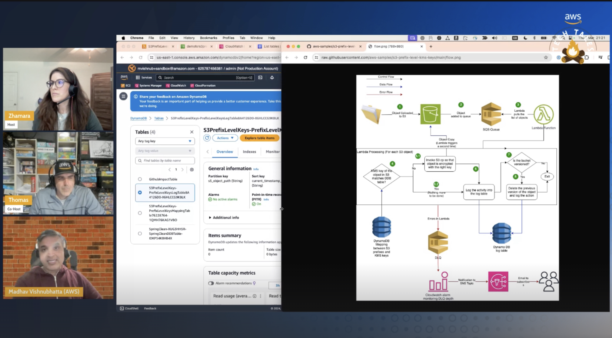

*(A Description of the episode along with any useful code snippets, images, and whatnot)*

Zhamara and guest host Thomas hear Madhav's tale on his customer issue on needing to encypt a bucket with different keys at the prefix level rather than the bucket level. He covers that as of Jan 2023, all buckets are encrypted by S3 by default (SSE-S3). In his demo he goes through the solution he built to enforce prefix level KMS keys on S3. 
 

*(the link the the TWITCH HIGHLIGHT)*
Check out the recording here:

https://www.twitch.tv/videos/2101692578

## Links from today's episode

- [Prefix Level KMS Keys - GitHub](https://github.com/aws-samples/s3-prefix-level-kms-keys/)

**🐦 Reach out to the hosts and guests:**

- Zhamara: [LinkedIn](https://www.linkedin.com/in/zhamarareano/)
- Thomas: [LinkedIn](https://www.linkedin.com/in/thomas-sceifers-ab4ba845/)
- Madhav: [GitHub](https://github.com/madhavvishnubhatta)
