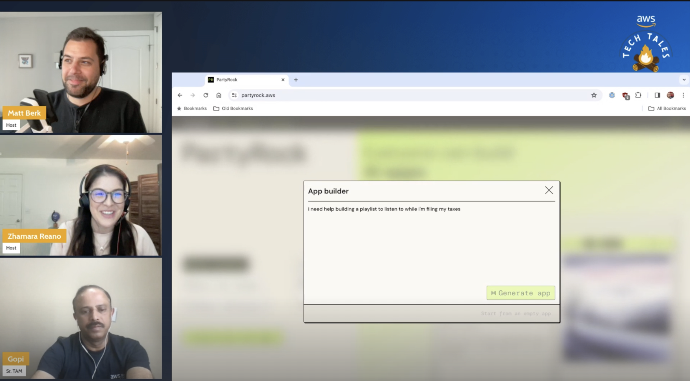

*(A Description of the episode along with any useful code snippets, images, and whatnot)*

So sometimes on Tech Tales, we have our own issues to resolve. This episode became an unplanned Part 1 of 2 after our guest Gopi had issues sharing his screen. We pushed his demo to Part 2 and instead collaborated with chat to build some new PartyRock apps and review retreival augmented generation (RAG). 
 

*(the link the the TWITCH HIGHLIGHT)*
Check out the recording here:

https://www.twitch.tv/videos/2095525246

## Links from today's episode

- [PartyRock](https://partyrock.aws/)
- [Bedrock Testimonials](https://aws.amazon.com/bedrock/testimonials/)

**🐦 Reach out to the hosts and guests:**

- Matt: [LinkedIn](https://www.linkedin.com/in/matthewlberk)
- Zhamara: [LinkedIn](https://www.linkedin.com/in/zhamarareano/)
- Gopi: [LinkedIN](https://www.linkedin.com/in/gopi-mudiyala-17a8081/)
