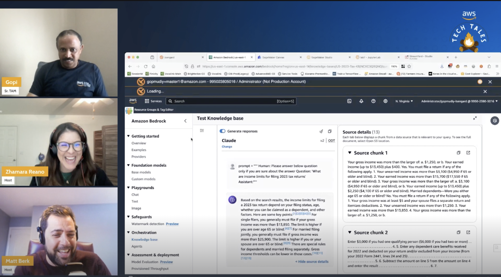

*(A Description of the episode along with any useful code snippets, images, and whatnot)*

So sometimes on Tech Tales, we have our own issues to fix. This episode became an unplanned Part 2 after our guest Gopi had issues sharing his screen. We got that resolved (folks check your Mac privacy settings) and Gopi was able to build out his demo. He covers an intro to Bedrock, retrieval augmented generation, and vector databases and then demos using an off the shelf LLM without RAG. He then creates a knowledge base full of tax documentation and shows the difference using RAG. 
 

*(the link the the TWITCH HIGHLIGHT)*
Check out the recording here:

https://www.twitch.tv/videos/2104231632

## Links from today's episode

- [What is RAG?](https://aws.amazon.com/what-is/retrieval-augmented-generation/)

**🐦 Reach out to the hosts and guests:**

- Matt: [LinkedIn](https://www.linkedin.com/in/matthewlberk)
- Zhamara: [LinkedIn](https://www.linkedin.com/in/zhamarareano/)
- Gopi: [LinkedIN](https://www.linkedin.com/in/gopi-mudiyala-17a8081/)
