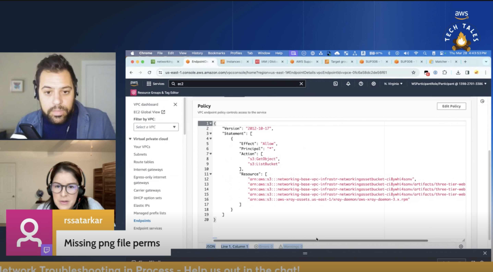

*(A Description of the episode along with any useful code snippets, images, and whatnot)*

Sometimes IT IS the network! In this episode Zhamara and Matt are recrutied by Happy-Cactus Industries to help fix their networking issues. They dive into load balancer timeouts, unhealthy web servers, and intermittent 504 errors trying to solve all the problems within the hour. While they don't get that far, they solve 5/6 issues by episode end. You can follow along too with the workshop link below! 
 

*(the link the the TWITCH HIGHLIGHT)*
Check out the recording here:

https://www.twitch.tv/videos/2111518871

## Links from today's episode

- [Workshop Link](https://catalog.us-east-1.prod.workshops.aws/workshops/fdf5673a-d606-4876-ab14-9a1d25545895/en-US/networking/)

**🐦 Reach out to the hosts and guests:**

- Matt: [LinkedIn](https://www.linkedin.com/in/matthewlberk)
- Zhamara: [LinkedIn](https://www.linkedin.com/in/zhamarareano/)

