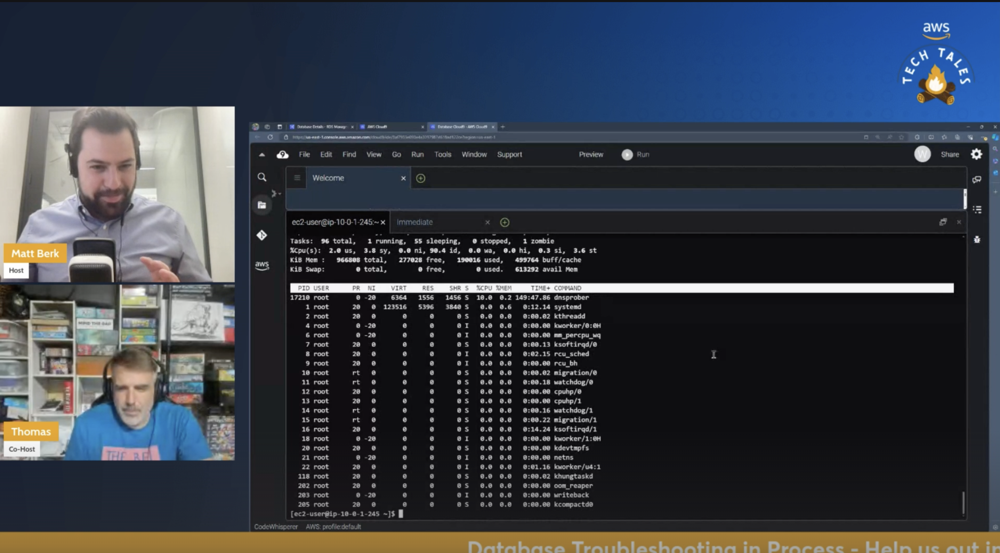

*(A Description of the episode along with any useful code snippets, images, and whatnot)*

Are you a DBAdmin just starting out on AWS? Then this episode is for you! Matt and guest host Thomas investigate common database issues and learn new DB troubleshooting skills as they dive into an unknown architecture. Along the way they demo Cloud9, CloudWatch Performance Insights, and RDS. The best part is you can follow along using the workshop link below. 

*(the link the the TWITCH HIGHLIGHT)*
Check out the recording here:

https://www.twitch.tv/videos/2111739169

## Links from today's episode

- [Workshop Link](https://catalog.us-east-1.prod.workshops.aws/workshops/fdf5673a-d606-4876-ab14-9a1d25545895/en-US/database)

**🐦 Reach out to the hosts and guests:**

- Matt: [LinkedIn](https://www.linkedin.com/in/matthewlberk)
- Thomas: [LinkedIn](https://www.linkedin.com/in/thomas-sceifers-ab4ba845/)

