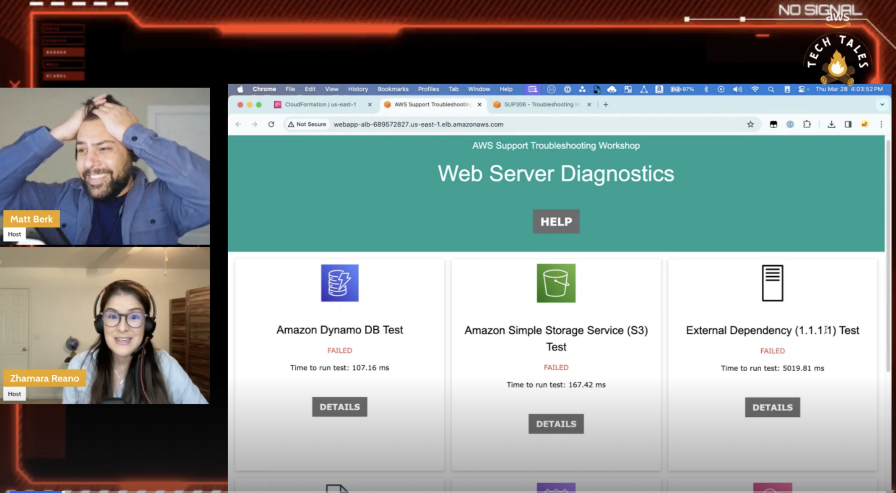

*(A Description of the show and what can the audience expect)*

Do you love a good story? Do you find the best way to learn is to fix it yourself? AWS Tech Tales is a weekly Twitch show where we tell stories of real AWS customer issues (either common or very specific), recreate them, and ask you to troubleshoot them live! The show will provide you the base level knowledge needed to dive in and will give you best practices that you can implement in your own environment. 

## Hosts the Show

- **Matt Berk** is a Principal Technical Account Manager based in Brooklyn who's passionate about storytelling, cloud technologies, and FinOps. When he's not solving customer issues, Matt can be either be found in nature with his dog Ollie, at popular NYC restaurants, or at home planning his next trip to a theme park. 
- **Zhamara Reano** is a Technical Account Manager based in California who seeks to elevate the experience of women in tech and promote career development of women. She likes running, hiking, cooking, traveling, spending time with her family, and of course, soccer. 

If you have any questions, comments, or ideas, **reach out** to us. Feel free to send us an email at: [aws-tech-tales@amazon.com](mailto:aws-tech-tales@amazon.com)

## Schedule

Come hear the tales and troubleshoot live with us! We stream every Thursday at 1pm Pacific/4pm ET.

## Season 3 (2024)

### Past Episodes
| Episode | Name | Date | Guest | Link to Video
|--|--|--|--|--|
| S03E01 | The Tale of the Missing S3 Bucket | 2024-02-15  | Hosts only | [Link to show notes](/livestreams/aws-tech-tales/2024-02-15/) |
| S03E02 | The Tale of the S3 Security Simulation  | 2024-02-22  | Hosts only | [Link to show notes](/livestreams/aws-tech-tales/2024-02-22/) |
| S03E03 | The Tale of the Multi-Region Architecture | 2024-02-29  | Eugene Istrati, Jack Lu | [Link to show notes](/livestreams/aws-tech-tales/2024-02-29/ |
| S03E04 | The Tale of S3 and a thousand keys | 2024-03-07  | Madhav Vishnubhatta | [Link to show notes](/livestreams/aws-tech-tales/2024-03-07/) |
| S03E05 | The Tale of Taxes with GenAI (Part 1) | 2024-03-14  | Gopi Mudiyala  | [Link to show notes](/livestreams/aws-tech-tales/2024-03-14/) |
| S03E06 | The Tale of Taxes with GenAI(Part 2) | 2024-03-21  | Gopi Mudiyala | [Link to shownotes](/livestreams/aws-tech-tales/2024-03-21/ |
| S03E07 | The Tale of Troubleshooting Network Services | 2024-03-28  | Hosts only| [Link to shownotes](/livestreams/aws-tech-tales/2024-03-28/) |
| S03E08 | The Tale of Troubleshooting Database Services | 2024-04-04  | Guest Host: Tom Sciefers | [Link to shownotes](/livestreams/aws-tech-tales/2024-04-04/) |

